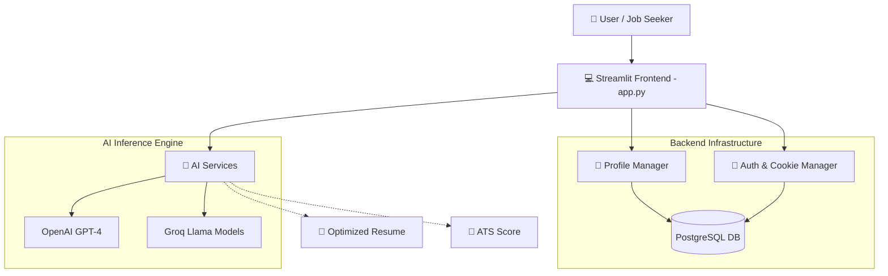

<div align="center">
  
# 🚀 Smart Resume AI — A Career Co-Pilot

[🎬 **Watch the Video Demo Here**](https://drive.google.com/file/d/1gLE3YFMC4mB7M797Pi5xigsri1OdctQz/view?usp=sharing)

*A next-generation, AI-driven ecosystem designed to secure your dream job by bridging the gap between raw talent and ATS expectations.*

[](https://github.com/ShadowAniket/AI-RESUME)
[](https://python.org)
[](https://streamlit.io/)

</div>

---

## 1. 🌌 The "50,000-Foot" View

### 🎯 Defining the Goal
In a market saturated with generic templates, **Smart Resume AI** acts as your personal career co-pilot. It is an intelligent assistant built to:
- **Beat the Robots:** Optimize profiles mathematically against Applicant Tracking Systems (ATS).
- **Impress the Humans:** Craft a compelling, Awwwards-level professional narrative highlighting key achievements.
- **Automate the Tedious:** Streamline cover letter generation, tailoring, and portfolio creation via Generative AI.

### 🍽️ The Metaphor: The Restaurant Architecture
Think of Smart Resume AI as a high-end restaurant:
- **The Dining Room (Frontend - Streamlit):** This is what the user sees. The interactive builder, the sleek dark-themed dashboards, and dynamic score meters. It dictates the vibe and takes the 'orders'.
- **The Kitchen (Backend - Python/SQLAlchemy):** Where the magic happens. The data is prepped, structured, and securely persisted.
- **The Executive Chefs (AI Models - OpenAI / Groq):** Taking the raw ingredients (your past experience) and plating them into an irresistible Michelin-star dish (an ATS-beating resume).

### 🏗️ System Architecture


---

## 2. 🎭 Tailored for the Audience

<table>
<tr>
<th width="50%">🏢 For Product Managers & Business</th>
<th width="50%">💻 For Developers & Peers</th>
</tr>
<tr>
<td>
<ul>
  <li><b>Hyper-Personalization:</b> Dynamically aligns user histories with job descriptions.</li>
  <li><b>Time-to-Value:</b> Reduces the hours spent tweaking resumes down to seconds.</li>
  <li><b>Analytics Driven:</b> Includes an Admin Dashboard monitoring system usage, conversion rates, and tool adoption.</li>
</ul>
</td>
<td>
<ul>
  <li><b>Data Flow:</b> Pydantic-like structured validation ensures state integrity before DB commits. UI interactions mutate <code>st.session_state.form_data</code>.</li>
  <li><b>Architectural Patterns:</b> MVC-inspired structure separating Streamlit views (<code>/views</code>) from database models (<code>/config</code>) and business logic (<code>/services</code>).</li>
  <li><b>Security:</b> Bcrypt password hashing and robust Alembic migrations.</li>
</ul>
</td>
</tr>
</table>

---

## 3. 🗺️ Code Walkthrough: The Chain of Actions

Let's dissect what happens when a user clicks: **"Generate ATS Score"**.

### 🏁 1. The Entry Point (`app.py`)
The application initializes via `app.py`. It dynamically loads environment configurations and validates session states:
```python
def main():
    # Renders the sidebar and handles initial authentication checks.
    # Maps navigation clicks to respective view modules.
```

### ⛓️ 2. The Chain of Action
When evaluating a resume inside `views/ats_optimizer.py`:
1. **Upload:** User drops a PDF. `PyPDF2` intercepts and parses the raw text stream.
2. **Analysis Routing:** The text is bundled with the target job description and sent to the core `ResumeAnalyzer`.
3. **Execution:** Our AI Services orchestrate a prompt injecting the parsed data. Generative AI evaluates keyword density, format, and semantic alignment.
4. **Rendering:** The calculated ATS metrics array returns to the UI. Streamlit dynamically updates the DOM, re-rendering progress bars and markdown warnings based on the JSON payload.

### 🧬 3. Key Data Models Definition
The heartbeat of our application logic resides inside the runtime `st.session_state.form_data`:
```json
{
  "personal_info": {"full_name": "...", "email": "..."},
  "experiences": [{"company": "...", "role": "..."}],
  "skills_categories": {"technical": ["React", "Python"]}
}
```
*Why this structure?* It maps cleanly 1:1 with both our SQLAlchemy ORM relationships and our external AI Prompt Templates, ensuring O(1) serialization without structural mapping layers.

---

## 4. 🎛️ Interactive & Visual Debugging

Static code reading only goes so far. Here is how to truly understand the project flow dynamically:

### 🐛 Live Debugging via VS Code
Instead of reading through files blindly, run the app attached to a debugger:
1. Open `.vscode/launch.json` and ensure it targets `streamlit run app.py`.
2. **Place a Breakpoint** at `utils/resume_analyzer.py` on the AI API call line.
3. Submit a dummy resume. Watch the variables window! You will see the raw prompt string dynamically populated before it is cast out to the Groq/OpenAI APIs in real-time.

### 🔍 Utilizing IDE Features
- Use **Go to Definition (F12)** on `self.pages` mapping in `app.py` to instantly jump to the respective component view.
- Use **Find All References (Shift+F12)** on `st.session_state.form_data` to see exactly which modules interact with our global data singleton, avoiding manual scrolling through hundreds of lines.

---

## 5. 📚 Essential Documentation Guidelines

For upcoming contributors and future maintainers, adhere strictly to these architectural standards:

- **Clear Mappings:** Provide a high-level project summary before modifying deeply nested `.py` logic. Keep `app.py` extremely thin—routing logic belongs in `views/`, processing in `utils/`.
- **The "Why" Comments:** Never tell me *what* `sorted(list)` does. Tell me *why* we are sorting the list.
  > ❌ **Bad:** `// Wait 2 seconds`  <br> 
  > ✅ **Good:** `// Delaying execution by 2s to prevent OpenAI rate limiting on the Free Tier context window.`
- **Commit History as Documentation:** When contributing, utilize semantic versioning. If you hit a bizarre edge case (e.g., weird PDF formatting failures), use `git blame` or annotated logs. Often, esoteric logic exists precisely to fix past platform anomalies.

---

## 6. 🛡️ Data Privacy & Security Disclosure

As this application handles sensitive personal information (Resumes/CVs), it is built with a **Privacy-First mindset** following OWASP AI Security principles. 

- **Ephemeral Processing:** Uploaded PDF files are processed in-memory. No resume data is permanently stored on the server unless the user explicitly saves it to their profile.
- **Secure API Orchestration:** All communication with AI Inference Engines (OpenAI/Groq) is encrypted via TLS 1.2+ in transit.
- **Data Minimization:** We only send the raw text necessary for analysis to the LLM. Personal Identifiable Information (PII) such as Phone Numbers and Addresses can be redacted before processing.
- **Secrets Management:** API keys and database credentials are never hardcoded. They are managed through Environment Variables and GitHub Secrets for CI/CD pipelines.
- **Local Deployment Option:** For maximum privacy, users can run the entire stack locally using Docker, ensuring no data ever leaves their machine except for the AI inference call.

---

## 7. 🚀 Comprehensive Installation Guide

Whether you are a recruiter testing the platform or a developer looking to contribute, choose the setup path that fits your expertise. 

### 🟢 Path A: The Non-Technical Route (Docker Setup)

Not a software engineer? No problem! Here is exactly how to get Smart Resume AI running without configuring complicated development tools.

**Step 1: Install Docker Desktop**
Docker is a tool that runs complete applications in isolated "containers", meaning you don't need to manually configure Python or databases. 
- Go to [Docker's official website](https://www.docker.com/products/docker-desktop/) and download Docker Desktop.
- Follow the installer instructions and leave Docker running quietly in the background.

**Step 2: Open Your Terminal**
The Terminal is simply a window where you can give your computer direct text commands.
- **Windows:** Press the `Windows Key`, type `cmd`, and press Enter.
- **Mac:** Press `Cmd + Space`, type `Terminal`, and press Enter.

**Step 3: Start the Application!**
Copy and paste this exact command into your terminal and press Enter:
```bash
docker-compose up --build -d
```
*(Docker will now automatically pull the Streamlit UI, wire up the PostgreSQL backend, and launch the platform. First-time setup may take a minute.)*

**Step 4: Access Your Career Co-Pilot**
When the terminal lets you type again, open your favorite web browser and visit:
👉 **`http://localhost:8501`**

---

### 💻 Path B: The Developer Route (Manual Local Setup)

For engineers looking to debug the AI LLM pipelines, manipulate the database schema, or contribute to the repository.

**Prerequisites:**
- Python 3.11+
- PostgreSQL (running locally)
- Git

**Step 1: Clone & Environment Setup**
```bash
# Clone the repository
git clone https://github.com/ShadowAniket/AI-RESUME.git
cd AI-RESUME

# Initialize and activate a Virtual Environment
python -m venv venv

# On Windows:
venv\Scripts\activate
# On Mac/Linux:
source venv/bin/activate

# Install core dependencies
pip install -r requirements.txt
```

**Step 2: Environment Variables Configuration**
Create a local PostgreSQL database named `ai_resume_db`. Then, create a `.env` file in the root directory to store your secure credentials:
```env
# Database Connections
DB_HOST=localhost
DB_PORT=5432
DB_NAME=ai_resume_db
DB_USER=your_postgres_user
DB_PASSWORD=your_postgres_password

# Default Admin Panel Credentials
ADMIN_EMAIL=admin@example.com
ADMIN_PASSWORD=secure_admin_password

# LLM Orchestration Keys (Required for AI generation)
OPENAI_API_KEY="sk-..."
GROQ_API_KEY="gsk_..."
```

**Step 3: Alembic Migrations & DB Seeding**
We use Alembic for our operational database schema versioning. Run these to scaffold your local tables:
```bash
# Push schema structures to your local PostgreSQL DB
alembic upgrade head

# Seed the initial admin user mapping
python setup_db.py
```

**Step 4: Boot the Engine**
```bash
# Launch Streamlit with execution logging
streamlit run app.py
```
Your local development server will securely spin up at `http://localhost:8501`. Every time you save a `.py` file, the UI will intercept the changes and Hot-Reload automatically!

---

## 8. 📄 License

This project is proudly open-source and licensed under the **MIT License**.

#### What this means:
- **✅ You Can:** Use this application anywhere, modify the code for your own projects, and even use it commercially.
- **✅ You Must:** Include the original copyright and permission notice in any copy you distribute.
- **❌ You Cannot:** Hold the original creators liable for any bugs, issues, or rejections from jobs (we provide the tools, but you bring the talent!). It is provided "as is".

See the full legal text in the [LICENSE.md](LICENSE.md) file.

<div align="center">
  <br>
  <i>Crafted with precision for the modern, AI-first ecosystem.</i>
</div>
